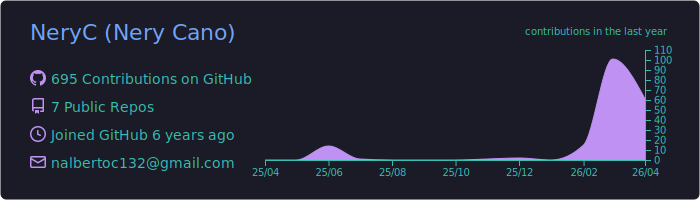
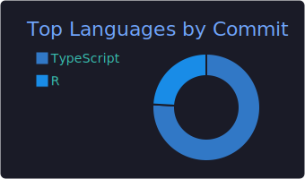
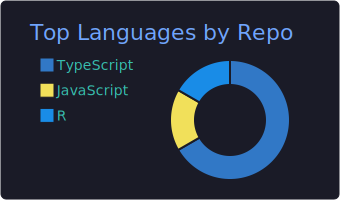

# Hi there, I'm Nery Cano! 👋

## Senior Full-Stack Software Engineer

I am a seasoned developer with **7+ years of experience** crafting robust web and mobile applications. Specializing in **Next.js**, **React Native**, and **AWS**, I build scalable systems for the Healthcare, Fintech, and Retail sectors.

- 🔭 **I’m currently working on:** High-performance healthcare platforms using **Next.js 15** and **React Native/Expo**.
- 🏗️ **Architecture:** I love designing Service-Oriented Architectures (SOA) and implementing CI/CD pipelines.
- 🏃🏻‍♂️ **Fun fact:** I apply the same endurance logic to marathon running as I do to solving complex backend challenges.

---

### 🛠️ Tech Stack

| Frontend | Backend & Data | DevOps & Tools |
| :--- | :--- | :--- |
|   |   |   |
|   |   |   |
|   |   |  |

---

### 💼 Professional Highlights

Even though most of my work is in **private enterprise repositories**, here is a summary of what I've engineered recently:

* **Healthcare Platform (2025):** Led the full-stack development of a patient monitoring system.
    * *Tech:* React Native, HealthKit, AWS Transcribe/Comprehend.
    * *Impact:* Reduced documentation time by **60%** using voice-to-text medical entity extraction.
* **Retail Platforms (Hollister & Abercrombie):** Enhanced user experience and performance for high-traffic e-commerce sites.
    * *Tech:* Next.js, Docker, React Testing Library.

---

### 🌟 Community & Leadership

I am passionate about building tech communities and sharing knowledge.

* **Organizer @ [GDG Asunción](https://gdg.community.dev/gdg-asuncion/)**: Leading the local Google Developer Group chapter. I organize events, workshops, and tech talks to foster growth in the Paraguayan developer ecosystem.
* **Tech Evangelist**: Promoting best practices in web development, cloud architecture, and career growth.

---

### 📊 GitHub Stats

  

### 🚀 Career Stats (7+ Years)

  
  
  
  

---

### 📈 Coding Habits

  

  
  

