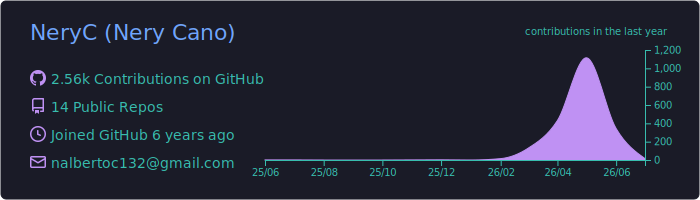
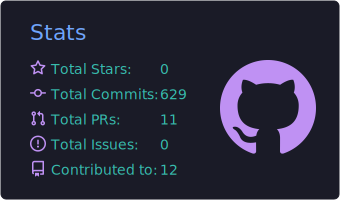
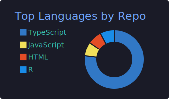

# Hi there, I'm Nery Cano! 👋

## Senior Full-Stack Software Engineer

I am a seasoned developer with **7+ years of experience** crafting modern web applications. Expert in **Next.js**, **React**, **Node.js**, and **Python**, working with both MongoDB and SQL databases to deliver end-to-end solutions. Specializing in front-end architecture, inclusive design (WCAG), and user experience, with a **strong understanding of SEO strategies and web performance optimization**. A runner at heart, I bring dedication and strategic thinking to every technical challenge.

- 🔭 **I'm currently working on:** High-performance healthcare platforms using **Next.js**, **React Native/Expo**, AI/ML & LLM integrations.
- 🤖 **AI-Powered Dev:** I leverage **Cursor**, **Claude Code**, and **Gemini CLI** to accelerate delivery and build smarter solutions.
- ♿ **Accessibility:** Expert in implementing **a11y** best practices and ensuring **WCAG** compliance.
- 🏃🏻‍♂️ **Fun fact:** I apply the same endurance logic to marathon running as I do to solving complex backend challenges.

---

### 🛠️ Tech Stack

| Frontend | Backend & Data | DevOps & Tools |
| :--- | :--- | :--- |
|    |    |   |
|    |    |   |
|   |    |   |
|    |   |   |

---

### 💼 Professional Highlights

Even though most of my work is in **private enterprise repositories**, here is a summary of what I've engineered:

* **Healthcare Platform – Jobsity (2025):** Led full-stack development of a clinician-facing patient monitoring system.
    * *Tech:* Next.js, React Native, GraphQL, React Query, AWS Transcribe/Comprehend, AI/ML, OCR.
    * *Impact:* Reduced documentation time by **60%** using voice-to-text medical entity extraction and LLM integration.
* **Education Platform – Penguin Academy (2024):** Lead developer of the CodePro platform for coding bootcamps.
    * *Tech:* Next.js, AWS, PostgreSQL, Vercel.
    * *Impact:* Enhanced engagement for **90+ students** with **99.9% uptime**.
* **Retail E-Commerce – Jobsity (2023):** Enhanced UX and performance for high-traffic e-commerce sites (Hollister & Abercrombie & Fitch).
    * *Tech:* Next.js (SSR/SSG), React, Node.js, Contentful, Docker, React Testing Library, Tailwind CSS.
* **Enterprise Maintenance – Kenility (2022):** Maintained and expanded core features of the ZenBusiness platform.
    * *Tech:* React, Next.js, Node.js, Docker, Tailwind CSS.
* **Salesforce Ecosystem – Oktana (2018–2022):** Engineered enterprise solutions for international clients.
    * *Tech:* Salesforce Apex, React Native, Electron, JavaScript frameworks.

---

### 🌟 Community & Leadership

I am passionate about building tech communities and sharing knowledge.

* **Organizer @ [GDG Asunción](https://gdg.community.dev/gdg-asuncion/)**: Leading the local Google Developer Group chapter. I organize events, workshops, and tech talks to foster growth in the Paraguayan developer ecosystem.
* **Tech Evangelist**: Promoting best practices in web development, cloud architecture, and career growth.

---

### 🎓 Education

* **B.S. in Computer Engineering** — Universidad Autónoma de Asunción *(Expected Graduation: 2026 — Thesis Phase)*

---

### 📊 GitHub Stats

  

### 🚀 Career Stats (7+ Years)

  
  
  
  

---

### 📈 Coding Habits

  

  
  

